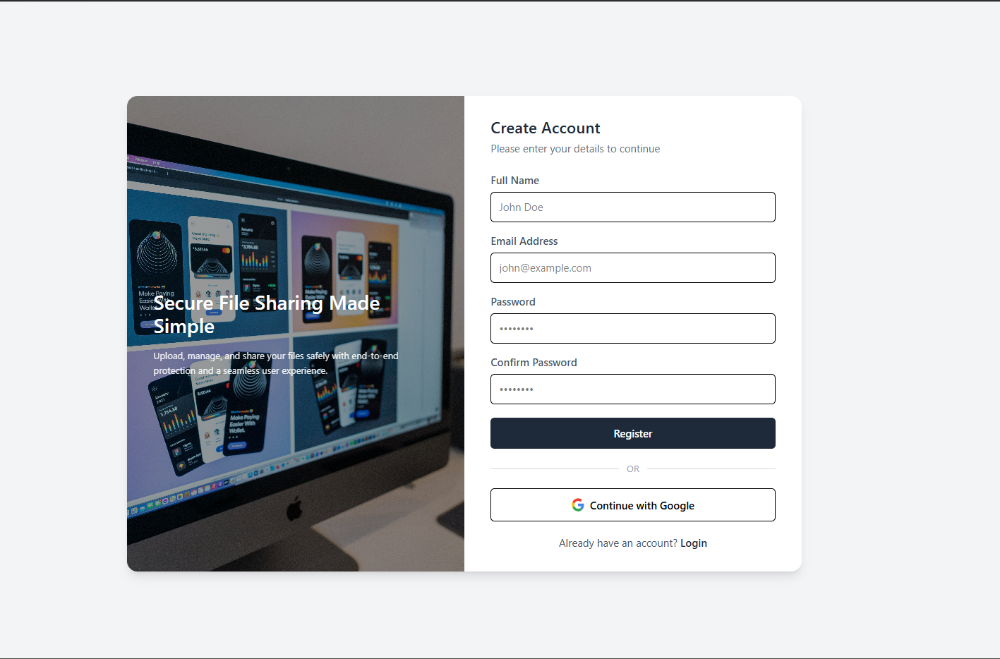
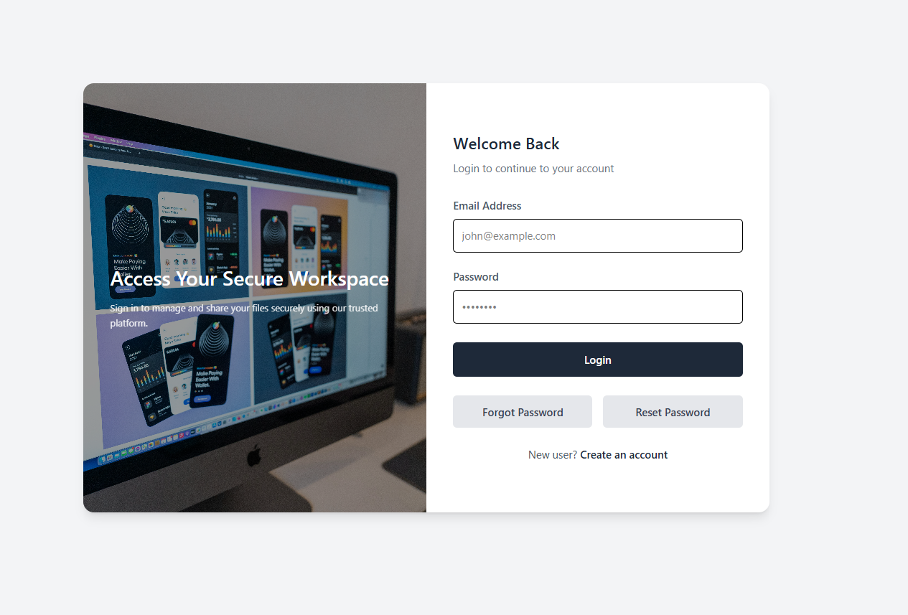
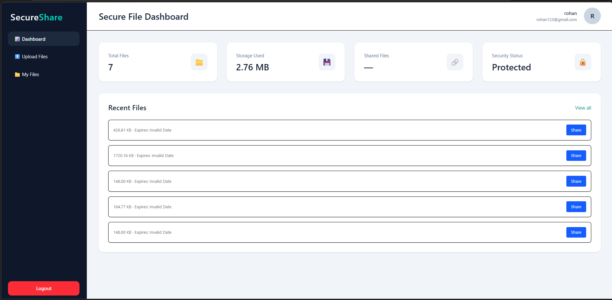
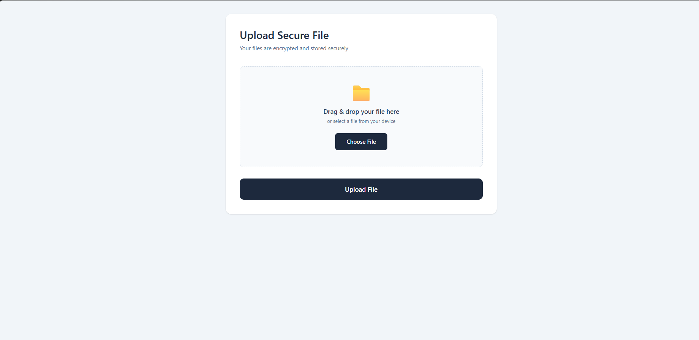
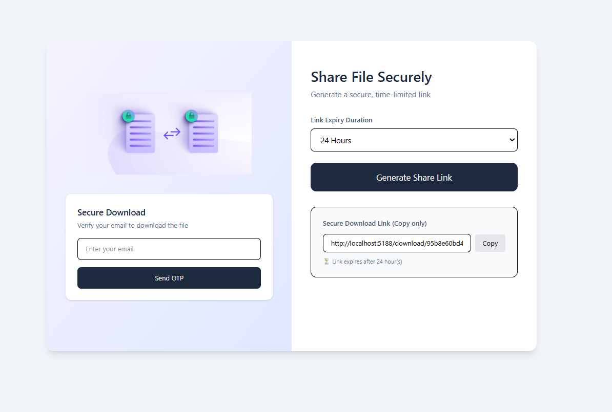
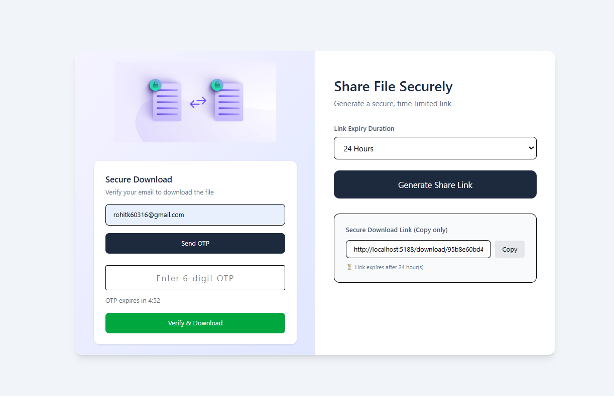
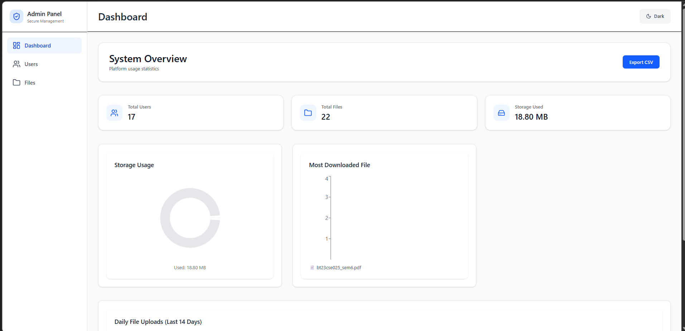
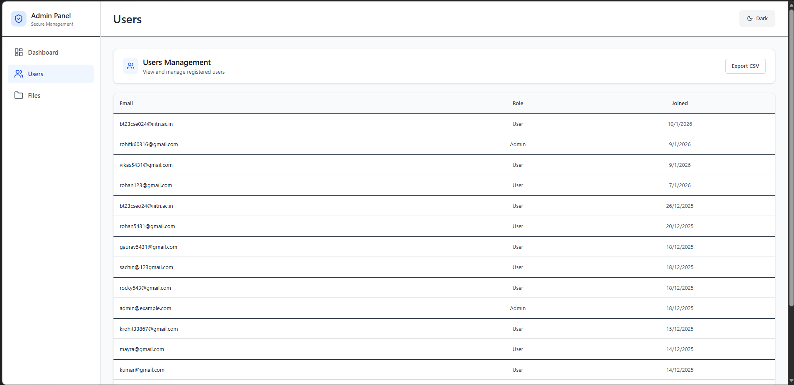
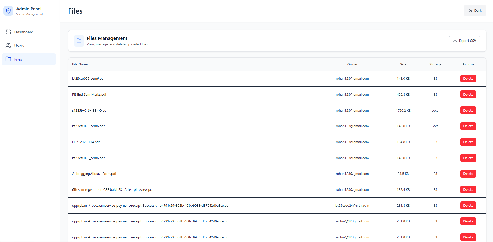

# 🚀 Secure File Sharing System with AI Security Layer

The **Secure File Sharing System** allows users to upload, encrypt, store, and share files safely. It protects confidentiality, integrity, and controlled access using encryption, authentication, OTP verification, role-based authorization, and an AI-powered security layer.

This project demonstrates real-world security practices used in modern web applications, including file encryption, secure sharing, live admin alerts, anomaly detection, and AI-based Data Loss Prevention (DLP). The original project overview emphasized secure upload, encryption, sharing, JWT authentication, Google OAuth, OTP verification, admin access, rate limiting, and centralized security controls. :contentReference[oaicite:1]{index=1}

---

## ✨ Key Features

### 🔑 Authentication & Authorization
- JWT-based authentication
- Secure login and registration
- Google OAuth 2.0 login
- Role-based access control (User / Admin)
- Protected routes on frontend and backend

### 🔐 File Security
- AES-based file encryption before storage
- Encrypted files stored locally or on AWS S3
- Secure decryption only for authorized users
- Unique encrypted file identifiers

### 📤 File Management
- Upload encrypted files
- Download and decrypt files securely
- View uploaded files
- Share files with controlled access

### 📧 OTP & Secure Sharing
- OTP-based secure file sharing
- Email verification for file access
- Time-bound access tokens

### 🛡️ System Protection
- Rate limiting to prevent API abuse
- Helmet security headers
- CORS protection
- Input validation
- Centralized error handling middleware

### 👨‍💼 Admin Panel
- View registered users
- View uploaded files
- Admin-only protected routes
- Scheduled admin reports using cron jobs

### 🤖 AI Security Layer
- AI-powered Data Loss Prevention (DLP) scanner
- Sensitive data detection before file encryption
- Live anomaly alerts for suspicious activity
- Real-time admin notifications using Socket.io
- Regex fallback when AI service is unavailable
- Heuristic engine for unusual user behavior

---

## 🧠 AI Security Layer Overview

This project adds a dedicated **AI Security Layer** to make file sharing safer and smarter.

### 1. AI-Powered Data Loss Prevention (DLP)
Before encrypting a file, the system scans the text/document using an AI model such as **Google Gemini** or **OpenAI**.

**Use case:**  
If a user accidentally uploads a file containing sensitive information like:
- Credit card numbers
- Passwords
- Aadhaar numbers
- SSNs
- Secret tokens or private keys

the AI detects it and shows a warning message before the file is shared or stored.

### 2. Live Alerts with Socket.io
When the system detects suspicious activity, it sends a real-time alert to the admin dashboard.

**Examples of suspicious activity:**
- Too many downloads in a short time
- Unusual login patterns
- File access at odd hours
- Multiple failed verification attempts

### 3. Custom Heuristic Engine
A custom heuristic engine runs inside the Node.js backend and uses MongoDB event logs to detect abnormal behavior.

**Examples:**
- Download spikes
- Access from unusual locations
- Off-hours activity
- Repeated access attempts

### 4. Regex Fallback Scanner
If the Gemini API is unavailable, the system automatically falls back to regex-based scanning.

This keeps the project secure even when the AI service is down and allows offline detection of:
- Aadhaar formats
- SSNs
- Credit card patterns
- Password-like strings

---
## 🧱 Tech Stack
<p>
  
</p>

## 🧱 Tech Stack

### 🌐 Frontend
- React.js
- React Router
- Axios
- Socket.io-client
- Tailwind CSS

### 🖥️ Backend
- Node.js
- Express.js
- MongoDB with Mongoose
- Passport.js (Google OAuth 2.0)
- JWT-based authentication

### 🔒 Security & Utilities
- AES encryption
- bcrypt for password hashing
- Multer for secure file handling
- Nodemailer for email services
- Rate limiting for API protection
- Helmet for HTTP security headers
- Cron jobs for scheduled tasks

### 🤖 AI & Real-Time Security
- Google Gemini AI SDK (`@google/generative-ai`)
- Socket.io for live alerts
- Custom anomaly engine
- Regex-based fallback scanner
- MongoDB aggregation / event-stream based heuristics

---

## 🏗️ Structural Architecture Breakdown

### 1. Client Layer (Frontend)
**Core:** React.js (Vite), Tailwind CSS  
**Networking:** Axios for REST, Socket.io-client for real-time events  
**Pages:** User Dashboard, Secure Upload Panel, Admin Dashboard with live alerts

### 2. Authentication Layer (Identity)
**Stateless Auth:** JSON Web Tokens (JWT)  
**SSO Integration:** Google OAuth 2.0 via Passport.js  
**Security:** Bcrypt password hashing

### 3. API & Core Logic Layer (Backend Server)
**Core:** Node.js, Express.js  
**File Management:** Multer for file interception  
**Secure Sharing:** OTP-based expiring links

### 4. Security & AI Layer (The Brain)
**AI DLP Scanner:** Intercepts uploads, reads file content, sends it to Gemini, or uses regex fallback  
**Encryption Engine:** Encrypts safe files via AES-256 streaming  
**Anomaly Engine:** Logs events, evaluates behavior, triggers alerts

### 5. Data & Storage Layer
**Database:** MongoDB / Mongoose stores users, metadata, logs, alerts, and tokens  
**Blob Storage:** AWS S3 or local disk stores encrypted `.enc` files

---

## 🔄 Security Flow

### Authentication Flow
1. User registers or logs in
2. JWT token is issued after successful authentication
3. Token is stored securely on the client
4. Protected routes validate JWT on every request
5. Admin routes require role verification

### File Encryption Flow
1. File uploaded by authenticated user
2. AI DLP scanner checks the content
3. If sensitive data is detected, user gets a warning
4. Safe file is encrypted using AES before storage
5. Encrypted file is stored locally or on AWS S3
6. Metadata is stored in MongoDB
7. File is decrypted only for authorized access

### Anomaly Detection Flow
1. User action is logged to MongoDB event stream
2. Heuristic engine evaluates the pattern
3. Suspicious behavior is flagged
4. Admin receives a real-time Socket.io alert

---

## 📡 API Overview

- `POST /api/auth/register`
- `POST /api/auth/login`
- `POST /api/files/upload`
- `GET /api/files/:id`
- `POST /api/files/share`
- `POST /api/otp/verify`
- `GET /api/admin/users`

---

## 🧪 Error Handling
- Centralized error handling middleware
- Proper HTTP status codes
- Validation and authentication errors handled securely
- No sensitive data exposed in responses

---

## 📸 Screenshots

<p align="center">
  
  
  
</p>

<p align="center">
  
  
  
</p>

<p align="center">
  
  
  
</p>

---

## 🏛️ System Architecture — Encrypted File Share + AI Security

```text
# ===========================
# CLIENT LAYER (Frontend)
# ===========================
┌─────────────────────────┐
│     Frontend Client     │
│  React + Tailwind CSS   │
│  Axios + Socket.io      │
└─────────────┬───────────┘
              │ HTTPS / REST / WebSocket
              ▼

# ===========================
# BACKEND API GATEWAY
# ===========================
┌──────────────────────────────────────────┐
│          Node.js + Express.js           │
│                                          │
│  ┌────────────────────────────────────┐  │
│  │ Authentication Layer               │  │
│  │ JWT / Google OAuth                 │  │
│  └────────────────────────────────────┘  │
│                                          │
│  ┌────────────────────────────────────┐  │
│  │ File Management                   │  │
│  │ Upload / Download / Share / OTP   │  │
│  └────────────────────────────────────┘  │
│                                          │
│  ┌────────────────────────────────────┐  │
│  │ AI DLP Scanner                    │  │
│  │ Gemini / Regex Fallback           │  │
│  └────────────────────────────────────┘  │
│                                          │
│  ┌────────────────────────────────────┐  │
│  │ Anomaly Engine                    │  │
│  │ Heuristics / Event Stream         │  │
│  └────────────────────────────────────┘  │
│                                          │
│  ┌────────────────────────────────────┐  │
│  │ Encryption Engine                 │  │
│  │ AES-256 Streaming                 │  │
│  └────────────────────────────────────┘  │
│                                          │
│  ┌────────────────────────────────────┐  │
│  │ Security Middleware               │  │
│  │ Helmet / Rate Limit / Validation  │  │
│  └────────────────────────────────────┘  │
└─────────────┬───────────┬───────────────┘
              │           │
              │           └──────────────► Socket.io Live Alerts
              │
              ▼

# ===========================
# DATA & STORAGE LAYER
# ===========================
┌──────────────────────────────────────────┐
│               Data Layer                 │
│  MongoDB Atlas                           │
│  - User Profiles                         │
│  - File Metadata                         │
│  - Audit Logs                            │
│  - Anomaly Alerts                        │
│  - Event Stream                          │
│                                          │
│  AWS S3 / Local Disk                     │
│  - Encrypted .enc Files                  │
└──────────────────────────────────────────┘
```
## 📁 Project Structure

### 🖥️ Backend

```
backend/
├── config/
│   ├── db.js
│   └── passport.js
├── controllers/
│   ├── auth.controller.js
│   ├── file.controller.js
│   ├── share.controller.js
│   ├── otp.controller.js
│   ├── admin.controller.js
│   └── downloadFileById.controller.js
├── middleware/
│   ├── auth.middleware.js
│   ├── admin.middleware.js
│   ├── rateLimit.middleware.js
│   ├── error.middleware.js
│   └── upload.middleware.js
├── models/
│   ├── User.js
│   ├── file.js
│   ├── OTP.js
│   ├── shareLink.js
│   ├── AuditLog.js
│   ├── AdminNotification.js
│   └── EventStream.js
├── routes/
│   ├── auth.routes.js
│   ├── file.routes.js
│   ├── share.routes.js
│   ├── otp.routes.js
│   └── admin.routes.js
├── utils/
│   ├── crypto_utils.js
│   ├── encryption.js
│   ├── generateToken.js
│   ├── sendEmail.js
│   ├── s3upload.js
│   ├── storage.js
│   ├── tokenGenerator.js
│   ├── dlpScanner.js
│   ├── anomalyEngine.js
│   └── regexFallback.js
├── cron/
│   └── adminReports.cron.js
├── uploads_encrypted/
├── server.js
└── package.json
```

### 🌐 Frontend

```
frontend/
├── public/
├── src/
│   ├── api/
│   │   ├── axios.js
│   │   └── admin.api.js
│   ├── auth/
│   │   └── ProtectedRoute.jsx
│   ├── components/
│   │   ├── Navbar.jsx
│   │   ├── FileCard.jsx
│   │   ├── UploadBox.jsx
│   │   ├── OTPInput.jsx
│   │   ├── Loader.jsx
│   │   └── LiveAlerts.jsx
│   ├── context/
│   │   └── AuthContext.jsx
│   ├── hooks/
│   │   └── useIdleLogout.js
│   ├── pages/
│   │   ├── Dashboard.jsx
│   │   ├── Upload.jsx
│   │   ├── MyFiles.jsx
│   │   ├── ShareFile.jsx
│   │   ├── Download.jsx
│   │   ├── VerifyOTP.jsx
│   │   └── admin/
│   │       ├── AdminDashboard.jsx
│   │       ├── AdminUsers.jsx
│   │       ├── AdminFiles.jsx
│   │       └── AdminAlerts.jsx
│   ├── App.jsx
│   └── main.jsx
├── vite.config.js
└── package.json
```
## ⚙️ Environment Variables

### 🖥️ Backend (`.env`)

```
PORT=5000
MONGO_URI=your_mongodb_url
JWT_SECRET=your_jwt_secret
ENCRYPTION_KEY=your_base64_encryption_key

CLIENT_URL=http://localhost:5181
FRONTEND_URL=http://localhost:5181
SERVER_URL=http://localhost:5000

GOOGLE_CLIENT_ID=your_google_client_id
GOOGLE_CLIENT_SECRET=your_google_client_secret

GEMINI_API_KEY=your_gemini_api_key

STORAGE=local
# options: local | s3
```

### 📌 Notes
- `ENCRYPTION_KEY` must be a **secure base64-encoded key**
- `JWT_SECRET` should be **long and random**
- Set `STORAGE=s3` when using **AWS S3**
- Never commit `.env` files to GitHub

## ▶️ How to Run Locally

### 1️⃣ Clone the Repository
```
git clone https://github.com/your-username/encrypted-file-share.git
cd encrypted-file-share
```

### 2️⃣ Backend Setup
```
cd backend
npm install
npm run dev
```

### 3️⃣ Frontend Setup
```
cd frontend
npm install
npm run dev
```

### 🌐 Access the Application
- Frontend: `http://localhost:5181`
- Backend API: `http://localhost:5000`

## 🚀 Future Improvements
- End-to-end encryption
- File versioning
- Virus scanning for uploads
- Download limits & expiry
- Activity dashboard & analytics

## 👨‍💻 Author

**Rohit Kumar**  
Computer Science Engineer  
Specialized in Backend Development & Security  

- GitHub: https://github.com/rohi5431 
- Email: rohitk60316@gmail.com
- Linkedln: https://www.linkedin.com/in/rohit-kumar-3707382a2/


